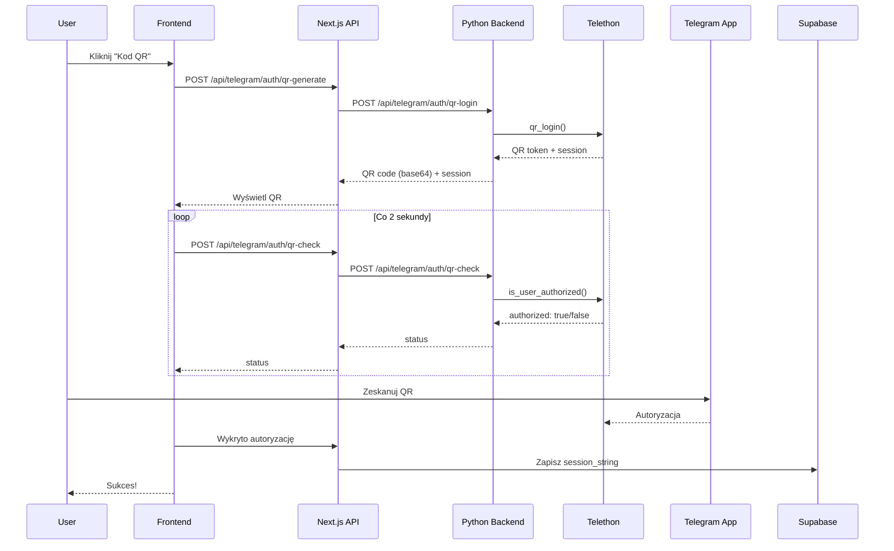

# 🚀 QR Login - Kompleksowy Przewodnik Wdrożenia

## ✅ Co zostało zrobione

1. ✅ **Frontend gotowy:**
   - `components/bots/qr-auth-dialog.tsx` - Dialog z QR kodem
   - `components/bots/auth-dialog.tsx` - Zaktualizowany z przyciskiem QR
   - `app/api/telegram/auth/qr-generate/route.ts` - API endpoint generowania QR
   - `app/api/telegram/auth/qr-check/route.ts` - API endpoint sprawdzania QR

2. ✅ **Backend gotowy:**
   - `python-backend/qr_auth.py` - Moduł QR autoryzacji z Telethon

3. ⚠️ **Wymagane ręcznie:**
   - Odblokowanie i edycja `python-backend/main.py`
   - Odblokowanie i edycja `python-backend/requirements.txt`
   - Wdrożenie na Railway

---

## 📝 Krok 1: Odblokuj pliki w v0

W v0, **kliknij prawym przyciskiem** na te pliki i wybierz **"Unlock"**:
- `python-backend/main.py`
- `python-backend/requirements.txt`

---

## 📦 Krok 2: Dodaj zależności do requirements.txt

Po odblokowaniu `python-backend/requirements.txt`, dodaj na końcu:

```txt
qrcode==7.4.2
pillow==10.2.0
```

Pełna zawartość powinna być:
```txt
fastapi==0.109.0
uvicorn==0.27.0
telethon==1.34.0
python-dotenv==1.0.0
supabase==2.3.4
qrcode==7.4.2
pillow==10.2.0
```

---

## 🔧 Krok 3: Dodaj endpointy QR do main.py

Po odblokowaniu `python-backend/main.py`, dodaj **na końcu pliku** (przed `if __name__ == "__main__"`):

```python
# ============ QR LOGIN ENDPOINTS ============

from qr_auth import generate_qr_login, check_qr_login

class QRLoginRequest(BaseModel):
    bot_id: str
    api_id: str
    api_hash: str

class QRCheckRequest(BaseModel):
    bot_id: str
    api_id: str
    api_hash: str
    client_session: str

@app.post("/api/telegram/auth/qr-login")
async def qr_login_endpoint(request: QRLoginRequest):
    """Generate QR code for Telegram login"""
    try:
        logger.info(f"=== QR LOGIN REQUEST ===")
        logger.info(f"Bot ID: {request.bot_id}, API ID: {request.api_id}")
        
        result = await generate_qr_login(
            int(request.api_id),
            request.api_hash
        )
        
        # Store client session for checking
        active_clients[request.bot_id] = {
            'client_session': result['client_session'],
            'api_id': request.api_id,
            'api_hash': request.api_hash,
            'login_token': result['login_token']
        }
        
        logger.info(f"QR code generated successfully")
        return result
        
    except Exception as e:
        logger.error(f"QR login error: {e}")
        raise HTTPException(status_code=500, detail=str(e))

@app.post("/api/telegram/auth/qr-check")
async def qr_check_endpoint(request: QRCheckRequest):
    """Check if QR code was scanned"""
    try:
        result = await check_qr_login(
            int(request.api_id),
            request.api_hash,
            request.client_session
        )
        
        # Clean up if authorized
        if result.get('authorized') and request.bot_id in active_clients:
            del active_clients[request.bot_id]
        
        return result
        
    except Exception as e:
        logger.error(f"QR check error: {e}")
        raise HTTPException(status_code=500, detail=str(e))
```

---

## 🚂 Krok 4: Wdróż na Railway

### Opcja A: Przez GitHub (zalecane)

1. **Commit zmiany:**
   ```bash
   cd python-backend
   git add .
   git commit -m "Add QR login functionality"
   git push
   ```

2. **Railway automatycznie wdroży** - poczekaj 2-3 minuty

### Opcja B: Bezpośrednie wdrożenie

1. **Zaloguj się do Railway CLI:**
   ```bash
   railway login
   ```

2. **Wdróż z folderu python-backend:**
   ```bash
   cd python-backend
   railway up
   ```

---

## 🧪 Krok 5: Testowanie

1. **Odśwież aplikację v0** (Ctrl+Shift+R)

2. **Kliknij "Autoryzuj" przy bocie**

3. **Wybierz "Kod QR (Zalecane)"**

4. **Powinieneś zobaczyć:**
   - ✅ QR kod do zeskanowania
   - ✅ Timer odliczający (domyślnie 180s)
   - ✅ Status "Oczekiwanie na skanowanie..."

5. **Otwórz Telegram na telefonie:**
   - Settings → Devices → Link Desktop Device
   - Zeskanuj kod QR
   - Potwierdź logowanie

6. **Automatyczne przekierowanie** po 2-3 sekundach

---

## 🎯 Jak to działa



---

## ❓ Rozwiązywanie problemów

### Problem: 404 Not Found na /api/telegram/auth/qr-login

**Przyczyna:** Railway nie ma nowych endpointów

**Rozwiązanie:**
1. Sprawdź czy dodałeś endpointy do `main.py`
2. Sprawdź logi Railway czy wystąpiły błędy podczas deployu
3. Zrestartuj Railway service ręcznie

### Problem: Import error: No module named 'qr_auth'

**Przyczyna:** Plik `qr_auth.py` nie został wgrany do Railway

**Rozwiązanie:**
1. Upewnij się że `qr_auth.py` jest w folderze `python-backend/`
2. Jeśli używasz GitHub - zrób commit i push
3. Jeśli nie używasz GitHub - uruchom `railway up` ponownie

### Problem: ModuleNotFoundError: No module named 'qrcode'

**Przyczyna:** Brak `qrcode` w `requirements.txt`

**Rozwiązanie:**
1. Odblokuj `requirements.txt`
2. Dodaj `qrcode==7.4.2` i `pillow==10.2.0`
3. Wdróż ponownie na Railway

### Problem: QR kod wyświetla się ale nie sprawdza statusu

**Przyczyna:** Backend nie ma endpointu `/api/telegram/auth/qr-check`

**Rozwiązanie:**
1. Sprawdź czy dodałeś oba endpointy do `main.py`
2. Sprawdź console przeglądarki czy są błędy 404
3. Sprawdź logi Railway

### Problem: "Invalid API key" lub błędy Supabase

**Przyczyna:** Niepoprawne zmienne środowiskowe w Railway

**Rozwiązanie:**
1. Przejdź do Railway Dashboard → Variables
2. Usuń lub popraw `SUPABASE_URL` i `SUPABASE_ANON_KEY`
3. Wartości znajdziesz w Supabase Dashboard → Settings → API

---

## 📊 Status implementacji

| Komponent | Status | Plik |
|-----------|--------|------|
| QR Auth Dialog (Frontend) | ✅ Gotowe | `components/bots/qr-auth-dialog.tsx` |
| Auth Dialog Integration | ✅ Gotowe | `components/bots/auth-dialog.tsx` |
| QR Generate API | ✅ Gotowe | `app/api/telegram/auth/qr-generate/route.ts` |
| QR Check API | ✅ Gotowe | `app/api/telegram/auth/qr-check/route.ts` |
| QR Auth Module (Python) | ✅ Gotowe | `python-backend/qr_auth.py` |
| Backend Endpoints | ⚠️ Wymaga dodania | `python-backend/main.py` (zablokowany) |
| Dependencies | ⚠️ Wymaga dodania | `python-backend/requirements.txt` (zablokowany) |
| Railway Deploy | ⚠️ Oczekuje | Po dodaniu endpointów |

---

## 🎉 Po wdrożeniu

Gratulacje! Twoja aplikacja ma teraz **dwie metody autoryzacji**:

1. **🚀 QR Kod (Zalecane):**
   - Szybkie (2-3 sekundy)
   - Bezpieczne (nie trzeba wpisywać kodu)
   - Wygodne (jeden scan)

2. **📱 SMS/App Kod:**
   - Tradycyjna metoda
   - Wymaga wpisania kodu
   - Działa gdy QR nie jest dostępny

Użytkownicy mogą wybrać preferowaną metodę przy każdej autoryzacji!
